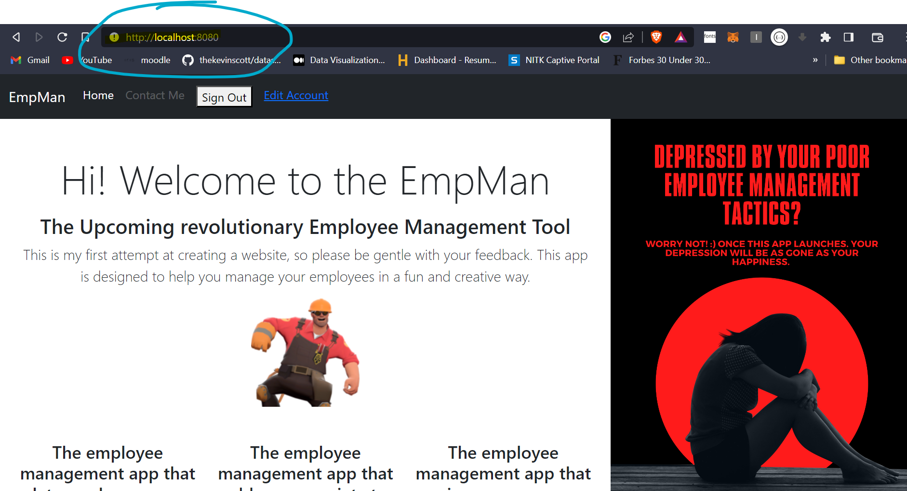
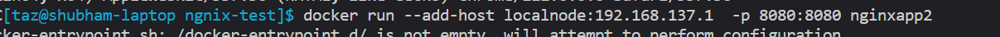
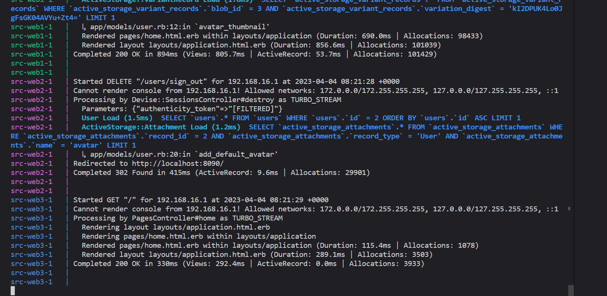

### IRIS Systems Recruitment Tasks


## Task 1: Dockerise this application

### Steps taken to dockerise the application

1. Created a Dockerfile in the root directory of the application




2. Created a docker-compose.yml file in the root directory of the application

### How to run the application

1. Clone the repository
2. Run `docker-compose up --build` in the root directory of the application
3. The application will be available at http://localhost:3000


3. Create Nginx Container as a reverse proxy to the application container

### Experience while trying this

I started learning about the feature of nginx which enables the user to use
it as a reverse proxy. I was able to create a dockerfile for the nginx container
and was able to run it. 

To test whether the nginx container was working as a reverse proxy, I created
a simple nodejs application and a simple go application. 

I was able to access the nodejs application at http://localhost:8081
and the go application at http://localhost:8082

I tried to add proxy_pass to the nginx server config 

```
location / {
            proxy_pass http://all/;
        }


```


Here the all is the name of the upstream server which is defined in the nginx.conf file

```

 upstream all {
        server localhost:8081;
        server localhost:8082;
    }

```

Note: Put a empty event {} block in the nginx.conf file for it to work or else it will give an error.


When I tried to access the application at http://localhost:8000, after I ran the nginx container with port 8080:8080, I got a bad gateway error.

I tried to debug the issue but was not able to find the solution. I tried to access the application container from the nginx container using curl but was not able to do so. 


After hours of trial and error, and a fair bit of stackoverflow scouting, I found out that the issue was with the docker network. I was able to access the application container from the nginx container using curl only when I ran the nginx container in the host network.

To fix this issue, while running the container I added a custom  host with local ip address 

```
docker run -d --name nginx --network host --add-host=localnode:ip_address nginxapp

```



One more issue I had here was that when I mentioned port as 8090 the nginx container was not able to access the application container. I had to mention the port as 8080 for it to work.

I was able to access the application at http://localhost:8080 after I ran the nginx container with port 8090:8090.

4. Launch two more instances of the application container

### Experience while trying this

I was able to launch two more instances of the application container using docker-compose.

I used nginx to load balance the requests between the three application containers.

### Results



As we can see from the above image, the three application containers are running as expected.

The signin request is handle by one 
of the application containers and the response is sent back to the user.

The signout request is handled by another application container and the response is sent back to the user.

Note: During attempting this, I discovered that you have to mention the service name in the nginx config file in the upstream block. 

```
upstream web {
        server web1:8080;
        server web2:8081;
        server web3:8082;
    }

```

I am yet to figure out why doesn't nginx work when I give 8080 as the port number and works only when 8090
is given as the port number.

5. Enable data persistence

I made use of volumes to make local file system to persist the data even after the containers are down

```
//for mysql database :

volumes:
      - ./mysql_data:/var/lib/mysql

// for nginx logs

volumes:
        - ./nginx/nginx.conf:/etc/nginx/nginx.conf
        - ./nginx/log:/var/log/nginx 

```

6. Using docker compose

This functionality was added during the attempt of previous steps.

7. Added rate limiting to nginx 

Used the limit_req_zone directive.

```
limit_req_zone $binary_remote_addr zone=mylimit:10m rate=10r/s;

location / {
            limit_req zone=mylimit burst=20 nodelay;
            limit_req_status 444;
            .....

}


```

8. Added backup deamon using python

Created a python script to backup the mysql database.

9. Added a health check endpoint

Added Github Actions for building and pushing the docker image to docker hub.


